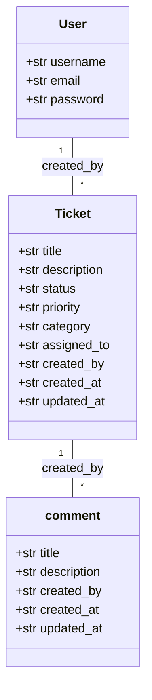
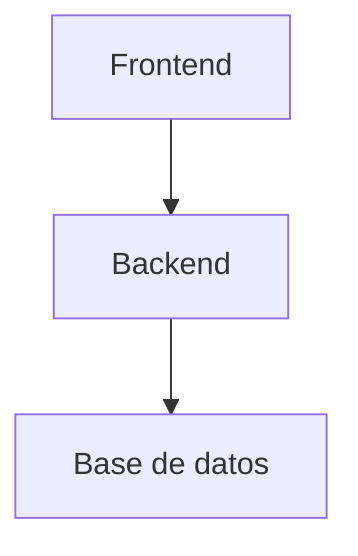
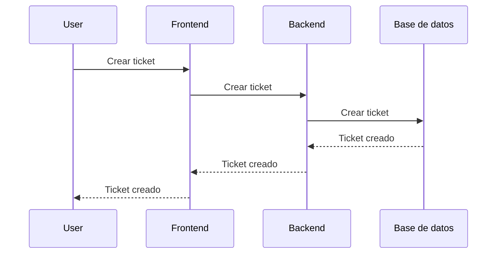

# Decisiones

las decisiones se tomaron en base a la facilidad de desarrollo en poco tiempo, por este motivo se eligio django y nextjs.

## Backend

Se eligio django por su facilidad de desarrollo (gracias a que practicamente se puede realizar un crud completo con solo definir el modelo) y su gran cantidad de librerias que facilitan el desarrollo de funcionalidades complejas como la autenticacion, ademas de su documentacion y comunidad.

## Frontend

Se eligio nextjs por el conocimiento que tengo de este framework e igualmente por su facilidad de desarrollo y su gran cantidad de librerias, que contienen componentes que se pueden usar rapidamente.

## Base de datos

Se eligio sqlite por su facilidad de uso y por el contexto de la prueba, que no requiere una base de datos compleja, ademas de que se puede usar docker para facilitar su despliegue.

# Diagramas
## Diagrama de clases

## Diagrama de despliegue

## diagrema de secuencia para la creacion de un ticket
